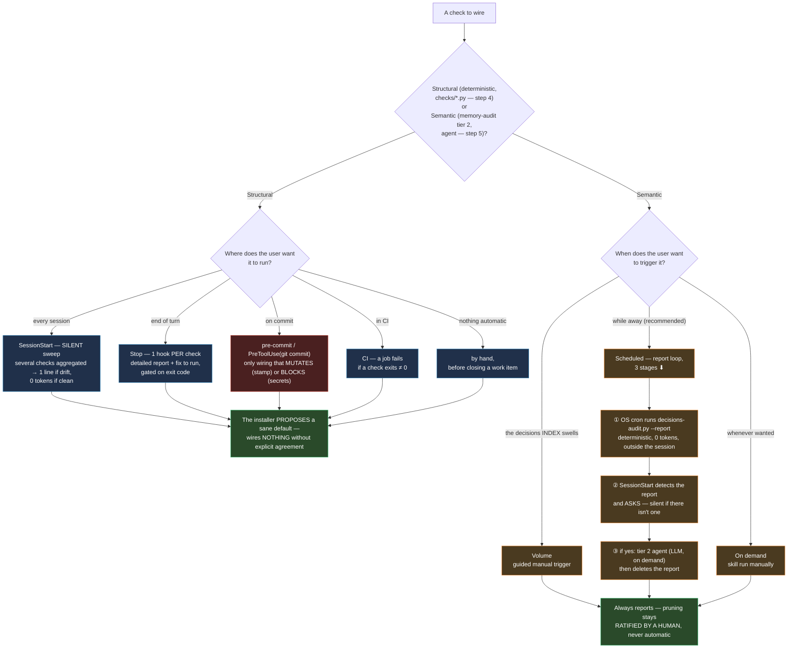

# Installing the memory framework — adoption guide

> **Status: notes + manual guide.** The artifacts (checks, hooks, decision/backlog templates) already
> exist; a human can adopt them by hand today by following the steps below. The **interactive
> `install.py`** that automates all this is still **to be built** — this file lists what it will
> need to offer.

## Guiding principle

**Detect + report; the user decides.** The framework never imposes itself — autonomy is
*offered*, not *forced*. In particular: **the user decides where and when the checks
run** (every session? at end of turn? on commit? in CI? by hand?). The installer
*proposes* sane defaults and *generates* the glue; it wires nothing without agreement.

## Prerequisites

- a **git** repo (the framework relies on git as a permanent record);
- **python 3** (`python` or `python3` — the scripts detect either).

## Wiring overview (steps 4 and 5)

Two natures of control, two distinct decision trees — **never the same wiring** for the
two (see `checks/README.md §To wire` for the detail of each pattern):

## Steps (manual today · what the installer will do tomorrow)

1. **Detect the context** — a git repo? which host (Claude Code? CI? git alone?)? is a
   memory already in place (`decisions/`, `backlog/`)?
   *Installer:* probes and overwrites nothing (idempotent).

2. **Scaffold the structure** — copy `decisions/`, `backlog/` (with the `backlog/STATE.template.md`
   template, to be copied as-is into `backlog/<id>/STATE.md`), `features/`
   (Feature channel, `FEATURE_MAP.md` as index), `checks/`, `hooks/`, `adapters/` (Claude Code
   adapter ready to wire — skills + hooks, see step 4), `ENTRY-TEMPLATE.md`, `MEMORY.md`,
   `FEATURE_MAP.md`, `DASHBOARD.md`, `WORKFLOW.md` from this framework into the host project,
   **only if missing**.
   *Installer:* copies + leaves existing files untouched; explicit `--force` to overwrite.
   > **Placement assumption — framework at the project root.** The Python scripts locate
   > their data relative to their own file (`checks/..` = framework root), while the
   > adapter hooks `cd` to the **project** root (`CLAUDE_PROJECT_DIR`) and call
   > `checks/…`, `.memory-reports/…` relative to it. Both agree as long as the framework
   > folders sit at the root of the host repo (the layout step 2 produces). If you vendor
   > the framework in a subfolder instead, adjust the paths inside
   > `adapters/claude-code/hooks/*.sh` (and `$YAMS_MEMORY_REPORT_DIR`) accordingly.

3. **Configure the index, the capture policy, and the global settings.**
   - **The index** — fill in `index/index-config.json` (roots + extensions to index, <!-- template -->
     optional `hub`) for `index-check.py` (read, checks for drift) **and** `index/manifest.py`
     (write, `set`/`rm`/`get`/`stamp` — the only way to edit `manifest.tsv`). Without config, both
     stay inactive.
   - **The capture policy** — copy `capture-policy.example.json` to `capture-policy.json` <!-- template -->
     (root) and pick a level per channel (`off` / `propose` / `draft`, see
     `knowledge-capture.md §Capture policy` for the full table). **Defaults:** `memory: draft`,
     `feature: propose`, `decision: propose`. Why the split — a `memory` entry left `unverified`
     is inert until cross-checked (provenance rule, `MEMORY.md §Provenance & confidence`), so
     `draft` is safe for it; `feature` and `decision` default to `propose` because they carry more
     structural weight (a feature entry routes future navigation, a decision records a structural
     choice) and a human ratifying at closure time is cheap relative to that weight — raise
     `memory` to `propose` too, or drop `feature`/`decision` to `draft`, if the project prefers a
     different balance. Then set `normative-paths` to the host project's own instruction files
     (e.g. `CLAUDE.md`, `.claude/rules/`) — these stay confirmation-gated no matter what level any
     channel gets, since a written rule acts on the agent from the very next session even
     unverified. As with every step here: the installer **proposes** the copy and the defaults, it
     **wires nothing without agreement** — same guiding principle as above. Once
     `capture-policy.json` <!-- template --> exists, its two enforcement pieces wire the same way
     as everything else here: `checks/capture-policy-check.py` <!-- template --> is a
     **structural** check, so it joins the other targets picked in step 4 below;
     `hooks/normative-write-guard.py` <!-- template --> is a **security guard** (an "ask"
     decision, like `destructive-guard.py`), so it joins the security guards referenced in step
     4's `adapters/claude-code/hooks/` bundle.
   - **The global settings** — optionally copy `checks-config.example.json` to
     `checks-config.json` <!-- template --> (root) to tune the thresholds every check and guard
     reads (`SCRIPTS.md §The global settings file`): the `audit` section (when the deterministic
     report recommends a tier-2 audit — per-channel volume alerts, ratification-inbox nudges,
     batch size), the `sizes` section (entry-granularity signals per channel), and the `guards`
     section (**extension-only** surveillance lists — extra watched instruction files for the
     poisoning scan, extra path-regex allowlist entries for the secret scan; no key can disable
     a guard). Skipping the copy is a valid choice: absent file = the built-in defaults, today's
     behavior. A present-but-broken file is a blocking `CFG-INVALID` on the checks side and a
     silent fallback to built-ins on the guards side — deliberate asymmetry, a guard in the
     write path must always answer.

4. **Wire the checks — the user chooses WHERE.** Plug the **structural**
   (deterministic) checks in wherever the user wants, with the **silent-on-success
   wrapper** (output = tokens injected → nothing on a clean state, one terse line per drift;
   see `checks/README.md §To wire`, skeleton included). Possible targets, pick any:
   - **Claude Code**: `SessionStart` (post-merge drift — start clean) · `Stop` (end of turn);
   - **git**: `pre-commit`;
   - **CI**: a job that fails if a check exits ≠ 0;
   - **manual**: nothing wired, run by hand before closing a work item.
   *Installer:* for Claude Code, **ready-made** hooks already exist in
   `adapters/claude-code/hooks/` (`SessionStart` sweep, `Stop` report, security guards,
   `pre-commit-stamp.sh` — the `PreToolUse(git commit)` hook **now stamps all three channels**
   `backlog/<id>/STATE.md`, `features/*.md`, `memory/*.md` before the commit goes out — and the
   **index-usage metrics pair** `index-usage-tracker.sh`/`index-usage-flush.sh`, which measures
   per session whether the cartography is consulted before sweeping a covered zone — a
   *targeted* single-file search never counts as a bypass, and consulting any channel index
   counts as consultation — plus its active half `index-nudge.sh`, a `PostToolUse(Grep|Glob)`
   hook that, on the first broad sweep of a covered zone in an unconsulted session, injects a
   note *next to* the raw results pointing to the index and the matching entries with their
   `updated` dates — never instead of them): the
   installer **references** them in `settings.json` instead of regenerating them from scratch. For `pre-commit` (git)
   or CI, it generates the **glue fragment specific to the detected host** — never wiring imposed.

5. **Semantic audit trigger — the user chooses WHEN.** The `memory-audit` audit (tier 2,
   all 3 channels — Feature/Decision/Memory, memory↔code) **is not a hook** (it costs an agent,
   doesn't run silently). Available regimes:
   - **Volume** — when a channel swells past its `audit.volume-alert` threshold
     (`checks-config.json`, defaults 285/150/150 for decision/feature/memory): the decisions <!-- template -->
     `INDEX` is the one that accumulates fastest, but the `--report` loop below now counts all
     three channels and folds any overflow into its recommendation;
   - **Scheduled — the report loop (recommended).** ⚠️ An **in-app** cron only runs if the tool
     is running (session off → doesn't fire). The workaround decouples **producing** (deterministic, no LLM)
     from **acting** (semantic, with LLM):
     1. an **OS cron** (Task Scheduler / `cron`) runs `checks/decisions-audit.py --report` →
        writes a **deterministic report** to a folder (`$YAMS_MEMORY_REPORT_DIR`, default
        `.memory-reports/`, **to be gitignored**). Headless, **0 tokens**, runs whenever the machine is on
        even without a session;
     2. the **`SessionStart` hook** detects the report and **asks the user**
        whether to process it (it only surfaces it — silent if there's no report);
     3. if the user says **yes**, the agent runs tier 2 (semantic, **LLM on demand**)
        only if the report recommends it, then **deletes** the report.
     → the audit "runs while you're away" (deterministic) **and** the LLM spend stays under
     **human control**. *(CI-only variant: a scheduled job with an API key can do tier 2 itself
     — more setup, real API cost.)*
   - **On demand** — the user runs the skill whenever they want.
   In every case it **reports**; pruning stays **ratified by a human** (never automatic
   pruning — `decisions/README.md §pruning`, `MEMORY.md §Provenance`).

6. **Verify** — run the checks once (`checks/*.py`), confirm they're green, summarize what was
   set up and where.
   *Installer:* runs them and prints a summary.

## Target shape of `install.py`

Interactive **but idempotent**: *detects → asks → generates the glue → writes its choices to an
`install-config`* (replayable, CI-friendly). Neither a pure wizard (fragile depending on host) nor a
passive checklist (not an "installer"). Still **to be built** — this file holds its spec; the framework's
`backlog/` is a **template** (to be copied into a host project), not the framework's own dev todo list.
