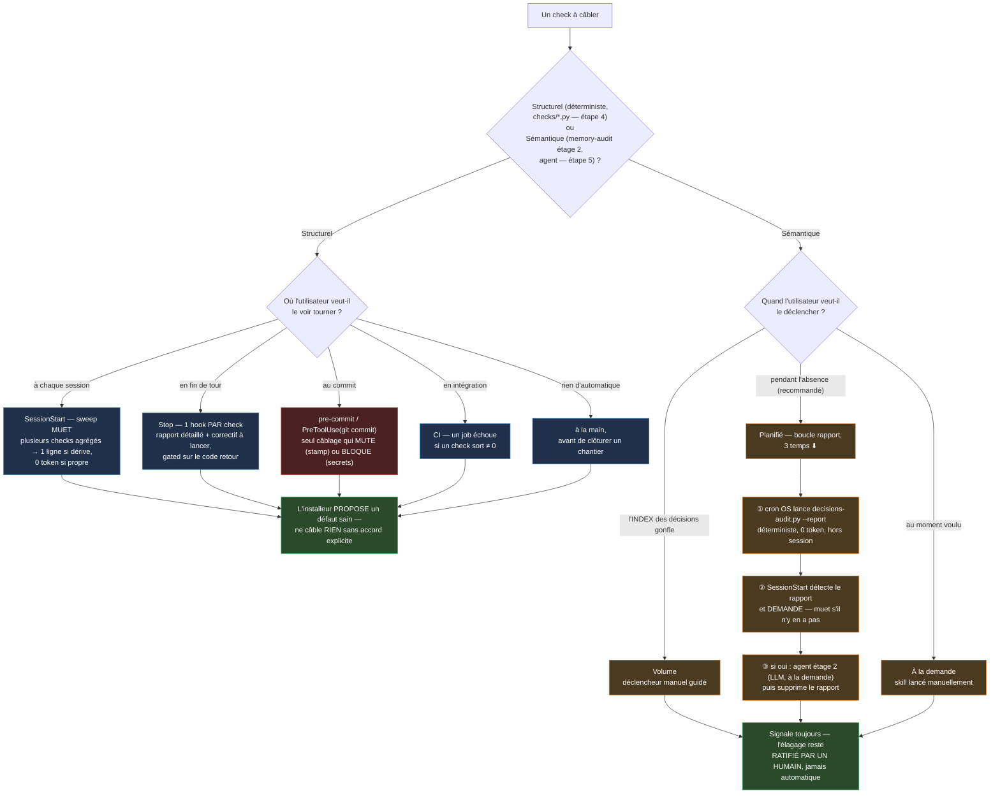

# Installer le framework mémoire — guide d'adoption

> **État : notes + guide manuel.** Les artefacts (checks, hooks, gabarits décisions/backlog) existent
> déjà ; un humain peut les adopter à la main aujourd'hui en suivant les étapes ci-dessous. Le
> **`install.py` interactif** qui automatise tout ça reste **à bâtir** — ce fichier liste ce qu'il
> devra proposer.

## Principe directeur

**Détecter + signaler ; l'utilisateur décide.** Le framework ne s'impose jamais — l'autonomie est
*offerte*, pas *forcée*. En particulier : **c'est l'utilisateur qui décide où et quand les checks
tournent** (à chaque session ? en fin de tour ? au commit ? en CI ? à la main ?). L'installeur
*propose* des défauts sains et *génère* la glu ; il ne câble rien sans accord.

## Prérequis

- un dépôt **git** (le framework s'appuie sur git comme registre permanent) ;
- **python 3** (`python` ou `python3` — les scripts détectent les deux).

## Vue d'ensemble du câblage (étapes 4 et 5)

Deux natures de contrôle, deux arbres de décision distincts — **jamais le même câblage** pour les
deux (cf. `checks/README.md §À câbler` pour le détail de chaque patron) :

## Étapes (manuel aujourd'hui · ce que l'installeur fera demain)

1. **Détecter le contexte** — dépôt git ? hôte (Claude Code ? CI ? git seul ?) ? une mémoire
   est-elle déjà en place (`decisions/`, `backlog/`) ?
   *Installeur :* sonde et n'écrase rien (idempotent).

2. **Échafauder la structure** — copier `decisions/`, `backlog/`, `checks/`, `hooks/`, `MEMORY.md`,
   `FEATURE_MAP.md`, `TABLEAU_DE_BORD.md`, `WORKFLOW.md` depuis ce framework vers le projet hôte,
   **si absents**.
   *Installeur :* copie + ne touche pas l'existant ; `--force` explicite pour réécraser.

3. **Configurer l'index** — remplir `index/index-config.json` (racines + extensions à indexer, <!-- gabarit -->
   `hub` optionnel) pour `index-check.py` (lecture, vérifie la dérive) **et** `index/manifest.py`
   (écriture, `set`/`rm`/`get`/`stamp` — seul moyen d'éditer `manifest.tsv`). Sans config, les deux
   restent inactifs.

4. **Câbler les checks — l'utilisateur choisit OÙ.** Brancher les checks **structurels**
   (déterministes) là où l'utilisateur veut, avec le **wrapper muet-sur-succès** (sortie = tokens
   injectés → rien sur état propre, une ligne terse par dérive ; cf. `checks/README.md §À câbler`,
   squelette inclus). Cibles possibles, au choix :
   - **Claude Code** : `SessionStart` (dérive post-merge — démarrer propre) · `Stop` (fin de tour) ;
   - **git** : `pre-commit` ;
   - **CI** : un job qui échoue si un check sort ≠ 0 ;
   - **manuel** : rien de câblé, lancés à la main avant de clôturer un chantier.
   *Installeur :* génère le **fragment de glu propre à l'hôte détecté** (bloc `settings.json`
   Claude Code, hook `pre-commit`, étape CI) — jamais un câblage imposé.

5. **Trigger de l'audit sémantique — l'utilisateur choisit QUAND.** L'audit `memory-audit` (étage 2,
   les 3 canaux — Feature/Décision/Mémoire, mémoire↔code) **n'est pas un hook** (il coûte un agent,
   ne tourne pas muet). Régimes au choix :
   - **Volume** — quand l'`INDEX` des décisions gonfle (déclencheur manuel guidé — le seul canal
     qui accumule assez pour ça ; Feature et Mémoire se relisent en entier, sans déclencheur volume) ;
   - **Planifié — la boucle rapport (recommandée).** ⚠️ Un cron **in-app** ne tourne que si l'outil
     tourne (session éteinte → ne part pas). La parade découple **produire** (déterministe, sans LLM)
     de **agir** (sémantique, avec LLM) :
     1. un **cron OS** (Task Scheduler / `cron`) lance `checks/decisions-audit.py --report` →
        écrit un **rapport déterministe** dans un dossier (`$UC_MEMORY_REPORT_DIR`, défaut
        `.memory-reports/`, **à gitignorer**). Headless, **0 token**, tourne machine allumée même
        sans session ;
     2. le **hook `SessionStart`** détecte le rapport et **demande à l'utilisateur** s'il faut le
        traiter (il ne fait que surfacer — muet s'il n'y a pas de rapport) ;
     3. si l'utilisateur dit **oui**, l'agent déroule l'étage 2 (sémantique, **LLM à la demande**)
        seulement si le rapport le recommande, puis **supprime** le rapport.
     → l'audit « tourne pendant que tu es absent » (déterministe) **et** la dépense LLM reste **sous
     contrôle humain**. *(Variante pur-CI : un job planifié avec clé API peut faire l'étage 2 lui-même
     — plus de setup, coût API réel.)*
   - **À la demande** — l'utilisateur lance le skill quand il veut.
   Dans tous les cas il **signale** ; l'élagage reste **ratifié par un humain** (jamais d'élagage
   automatique — `decisions/README.md §pruning`, `MEMORY.md §Provenance`).

6. **Vérifier** — lancer les checks une fois (`checks/*.py`), confirmer le vert, résumer ce qui a été
   posé et où.
   *Installeur :* exécute et imprime un récapitulatif.

## Forme cible de l'`install.py`

Interactif **mais idempotent** : *détecte → demande → génère la glu → écrit ses choix dans un
`install-config`* (rejouable, CI-friendly). Ni wizard pur (fragile selon l'hôte), ni checklist
passive (pas un « installeur »). Reste **à bâtir** — ce fichier en tient la spec ; le `backlog/` du
framework est un **gabarit** (à copier dans un projet hôte), pas le todo de développement du framework.
