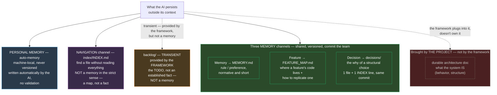

# Working method with an AI — process framework

> **What.** A **work process** for an AI to develop on a project, **derived** from The Undeath Curse's method. It says *how to work and remember* — **not** which tech, which architecture, nor which code tools. **That's the project's job** (its doc, its tools, its review skill).
> **Agnostic** to the tool (Claude Code, Copilot, other — placement in `README.md`) **and** to the tech/architecture.
> **Seed**: drop it in as-is, then **amend** it to fit the project.

## Glossary

Reference terms for this framework — the same word means the same thing across every doc here.

- **work item** — a unit of not-yet-built work tracked in `backlog/`.
- **milestone** — a named group that orders work items in `backlog/INDEX.md`.
- **durable** — content that describes what exists (architecture, memory channels) and persists past a single work item's closure.
- **transient** — content scoped to work in progress (the backlog); it migrates to durable or disappears at closure.
- **knowledge capture** — the self-improvement step: routing a reusable method-level learning to the right home.
- **entry** — one memory record (file + index line) following the common schema in `ENTRY-TEMPLATE.md`.
- **channel** — one of the three durable memory tracks (Memory, Feature, Decision), or the navigation channel.
- **tier 1 / tier 2** — the two-layer audit model: tier 1 = deterministic mechanical check (a script that observes), tier 2 = semantic review (judgment, by the project's review).
- **ratify** — a human confirming a proposed change (e.g. promoting an entry to `verified`), recorded as `ratified: <who>, <date>`.
- **drift** — a memory entry (or doc) that has fallen out of sync with the real code.
- **pruning** — retiring a memory entry once its subject is gone, superseded, or redundant with a living authority.

## The work loop

For every task, the AI:

1. **Orients, then verifies** — before coding: read the navigation index (`index/INDEX.md`), `MEMORY.md` (shared preferences that might constrain the task) and, if the task touches a known feature, its entry (`FEATURE_MAP.md`). **Never** sweep the whole codebase. And **never trust blindly**: a memory entry can be stale (*"an entry that lies is worse than none"*) — cross-check against the real code before relying on it.
2. **Develops** — applying **the project's standards** (its doc, its instruction files, its review skill), never invented rules. When no documented rule exists: **ask, don't assume**.
3. **Validates** — once it's good (validation runs through the **project's** own tools / review).
4. **Updates the durable record** — the doc describing *what exists*, **and** the memory entries it affects (feature entry, decision if a structural choice was made). **At the same time** as the code, never "later" — including **at the end of every task** within a work item that produces durable knowledge, not only at its closure (`backlog/README.md`). A shared-memory write carries its **source + confidence** (`MEMORY.md`) — no unverified external content gets promoted to "fact".
5. **Self-improves** — capture the *method*-level learning (see §Knowledge capture).
6. **Hands back** — summarize what changed; the user drives what's next.

> No PR or Git gate imposed. The loop stops at "durable record up to date + self-improvement", then the human takes over. The project wires this into **its own** closure ritual (its review skill, its merge, or nothing).

## Work in progress — the backlog

**Open work** (the *todo*) lives in `backlog/` — distinct from the three memory channels (which hold *durable* content). This is where a work item gets **broken down into tasks** and progress gets tracked.

- `backlog/INDEX.md`: the list of not-yet-built work, **read first**. Status per entry (`todo` / `in-progress`); a **finished** work item is **removed**.
- **The chain**: `spec` → `backlog` (decided, not built) → *in progress, broken into tasks* → on delivery, the content **migrates to the durable record** and the item leaves the backlog.
- **Closing** follows an ordered procedure (the Definition of Done, `backlog/README.md`): durable record written → decision if structural → removed from backlog → **status updated** (`DASHBOARD.md`) → **knowledge capture**.

## Steering — plan / status / todo

Three roles, never conflated:

- **The plan** (the order, the sequencer) — the **milestone** groups in `backlog/INDEX.md` (`### Milestone N — <name>`). No separate document: the milestone *is* the plan, it orders the work items.
- **The status** (where things stand, to resume) — `DASHBOARD.md`: progress per milestone + hot spots, in 1 page, updated **at closure** of a work item (`backlog/README.md §DoD`).
- **The todo** (work not yet done) — `backlog/INDEX.md` (§Work in progress, above).

The detailed, **live** status view (`checks/backlog-check.py --board`) stays **generated**; never duplicated by hand into `DASHBOARD.md`.

## The three memories (what the AI persists outside its context)

The process holds together because the AI **persists** durably, across three channels:

- **Feature** → `FEATURE_MAP.md`: per feature, *where* the code is + *how* to add another one (the replication pattern). Read before touching a feature; updated at the same time as the code.
- **Decision** → `decisions/`: the *why* behind structural choices. 1 file per decision + a scannable INDEX. Read the INDEX first; open the detail only when needed.
- **Memory** → `MEMORY.md`: preferences and learnings. **Shared** (team rule, versioned) vs **personal** (machine-local, unversioned) — never mix the two.

Plus a pure **navigation** channel: `index/INDEX.md` — find a file without reading everything.

### Overview

### Per-channel detail — what governs each

| | Personal (auto-memory) | Memory (`MEMORY.md`) | Feature (`FEATURE_MAP.md`) | Decision (`decisions/`) | Navigation (`index/INDEX.md`) |
|---|---|---|---|---|---|
| **Scope** | you only, this machine | whole team | whole team | whole team | whole team |
| **Versioned** | no | yes | yes | yes | yes |
| **Who writes** | the AI, automatically | human, or AI proposes + human ratifies | updated **at the same time** as the code, never after | at closure of a work item that settled a structural choice | never by hand — through the manifest tool |
| **Validation** | none | source + confidence before promotion (`MEMORY.md`); mechanical integrity via `checks/memory-check.py` (unverified external source = blocking); staleness via `memory-audit.md` (tier 2) | verified by the integrity check (entry complete, file↔index concordance); semantic freshness via `memory-audit.md` (tier 2) | `INDEX.md` scanned **before** any new structural direction; contradiction → tracked revocation, never a silent overwrite | drift check at startup + at closure, silent if nothing moved |
| **If it's wrong** | misleads only you | misleads the whole team | sends you to the wrong file | forces a re-debate of an already-settled choice | sends you looking in the wrong place |

The **Fact** (durable architecture doc — what the system *is*) is **not** a framework channel: it's **the project** that brings and maintains it (`WORKFLOW.md §Where things go`: "the project's durable architecture doc"). The framework **plugs into it** ("update the durable record" at step 4 of the loop) without defining its format or location. The **backlog**, on the other hand, is indeed **provided by the framework** (unlike the Fact) — but it isn't a memory channel for all that: it stays **transient** (work not yet done), never **durable** (an established fact); see §Work in progress.

## Where things go — the placement router

A piece of information in hand → **where does it go?** This table **consolidates into one view** a logic that would otherwise be scattered (decision entry gate, transient→durable cycle, knowledge-capture routing, entry scope).

| You have… | → goes in | Cue (and what does **not** go there) |
|---|---|---|
| work **not done yet** | `backlog/` | the *todo*; not a fact/durable content |
| *where* a feature's code is + *how* to rebuild one | `FEATURE_MAP.md` | the replicable wiring; not the *why* |
| the *why* of a **structural choice** (that would otherwise get re-debated) | `decisions/` | pivot/dropped feature/cross-cutting convention; **not** a rename, a bugfix, a one-off wiring detail |
| a **team rule/preference**, normative and short | `MEMORY.md` | the shared norm; not a fact about what exists |
| a **fact about what exists** (behavior, structure) | the project's **durable architecture doc** | what *is*; not the *why* (→ decision) |
| "where is X" | `index/INDEX.md` | the map; not the content |
| a **method** learning | **knowledge capture** (`knowledge-capture.md`) | skill/hook/rule/test… |
| **nothing cross-cutting** (local detail) | the **code / the spec** | above all **not** a memory entry — it would pollute |

**Golden rule**: a local detail with no cross-cutting invariant **never** goes into a memory entry. Hard cases ("is this really decision-worthy?") → the entry-gate test in `decisions/README.md`.

## Doc lifecycle

Separate the **transient** (work in progress — it lives in the `backlog`, see above) from the **durable** (what exists). At the end of a work item, the content **migrates** to the durable record and the item leaves the backlog. Never duplicate transient/durable content on the same subject.

## Knowledge capture (self-improvement)

At the end of a work item, **ask the question**: *did this work reveal a reusable **method** learning?* "Nothing" is a valid answer, but the question is **asked**, never skipped by default. If yes, file it in the right place. **How to decide what to do with it** — the "is it worth tooling?" gate + routing by function (agnostic), then to the tool's mechanism: `knowledge-capture.md`. That's what makes the process **grow** instead of freezing in place.

## Delegation (for heavy lifting)

When a task exceeds a single pass, break it down and hand it to **typed roles with clear boundaries** ("does X; does NOT do Y"). The project defines the useful roles; the process only supplies the principle.

## Deterministic checks (keeping the process honest)

The process **verifies itself** through **deterministic, zero-false-positive** checks — the first tier of a **two-level** pattern: the *mechanical check* (a script that **observes**, doesn't judge) **→** *semantic review* (judgment, carried by the **project's review**). None of them fix anything: they **flag**.

Provided under `checks/` (agnostic): **backlog integrity** (`backlog-check`), **decision integrity** (`decisions-check`) and **feature map integrity** (`feature-map-check`) — orphans, dead pointers, consistent statuses/ids. To be **wired to run automatically** at the right moment (end-of-task/end-of-session hook, or CI — depending on the tool).

**Multi-channel memory audit**: `checks/memory-audit.py` orchestrates the integrity of the **three channels** in a single pass (`--tier1`: `feature-map-check` + `decisions-audit --tier1` — which already covers decisions/doc/index/backlog on its own — + `memory-check`, without duplicating any of the three). The Decision channel, the only one that accumulates enough to justify it, keeps its own batching (`checks/decisions-audit.py --plan/--merge`, **coverage check**: every decision audited exactly once) — the concrete execution of the "Volume" trigger. Tier 2 (judgment — memory↔code drift for Decision, entry freshness for Feature, ratification of `unverified` entries for Memory) follows the review **rubric** `checks/memory-audit.md`, which delegates its decisions portion to `checks/decisions-audit.md`. A canonical recipe that a **per-tool installer** turns into a skill/subagent.

The project adds its **own** code checks (lint, tests, analyzers): tech-specific, so it's on the project. The process only supplies *method* checks + the two-tier pattern + the universal guardrails (secret scanning, destructive-command guard — to be ported).

## What the process does NOT supply — that's the project

- **Architecture** (layers, modules, organization) — its own.
- **Code tools** and standards (build, lint, tests, **review**) — its own.
- **Technical doc** and best practices — its own.

The process **plugs into these**: wherever it says "the project's standards", it *points* to the project's own doc / tools. It doesn't replace or invent them.
