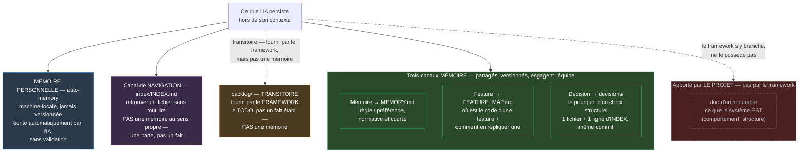

# Méthode de travail avec une IA — framework de process

> **Quoi.** Un **process de travail** pour qu'une IA développe sur un projet, **dérivé** de la méthode de The Undeath Curse. Il dit *comment travailler et mémoriser* — **pas** quelle techno, quelle architecture, ni quels outils de code. **Ça, c'est le projet qui l'apporte** (sa doc, ses outils, sa skill de review).
> **Agnostique** à l'outil (Claude Code, Copilot, autre — placement dans `README.md`) **et** à la techno/archi.
> **Graine** : déposer tel quel, puis **amender** selon le projet.

## La boucle de travail

À chaque tâche, l'IA :

1. **Se repère, puis vérifie** — avant de coder : lire l'index de navigation (`index/INDEX.md`), `MEMORY.md` (préférences partagées qui pourraient contraindre la tâche) et, si la tâche touche une feature connue, sa fiche (`FEATURE_MAP.md`). **Ne jamais** parcourir tout le code. Et **ne pas faire confiance aveuglément** : une mémoire peut être périmée (« une fiche qui ment est pire qu'absente ») — recouper avec le code réel avant de s'appuyer dessus.
2. **Développe** — en appliquant **les standards du projet** (sa doc, ses fichiers d'instructions, sa skill de review), jamais des règles inventées. En l'absence de règle documentée : **demander, pas présumer**.
3. **Valide** — quand c'est OK (la validation passe par les outils / la revue **du projet**).
4. **Met à jour le durable** — la doc qui décrit *ce qui existe*, **et** les mémoires impactées (fiche feature, décision si choix structurel). **Au même moment que le code**, jamais « plus tard » — y compris **à la fin de chaque tâche** d'un chantier qui produit du savoir durable, pas seulement à sa clôture (`backlog/README.md`). Une écriture en mémoire partagée porte sa **provenance + confiance** (`MEMORY.md`) — pas de contenu externe non vérifié promu en « fait ».
5. **S'auto-améliore** — capitaliser l'apprentissage de *méthode* (voir §Capitalisation).
6. **Rend la main** — résumer ce qui a changé ; l'utilisateur pilote la suite.

> Pas de PR ni de gate Git imposés. La boucle s'arrête à « durable à jour + auto-amélioration », puis l'humain reprend. Le projet branche ça sur **son** rituel de clôture (sa skill de review, son merge, ou rien).

## Le travail en cours — le backlog

Le **travail ouvert** (le *todo*) vit dans `backlog/` — distinct des trois mémoires (qui, elles, sont du *durable*). C'est là qu'on **découpe un chantier en tâches** et qu'on suit l'avancement.

- `backlog/INDEX.md` : la liste du non-bâti, **lue en premier**. Statut par entrée (`todo` / `in-progress`) ; un chantier **fini est retiré**.
- **La chaîne** : `spec` → `backlog` (décidé, pas bâti) → *en cours, découpé en tâches* → à la livraison, le contenu **migre vers le durable** et l'item quitte le backlog.
- **Clôturer** suit une procédure ordonnée (la DoD, `backlog/README.md`) : durable écrit → décision si structurel → retrait du backlog → **état mis à jour** (`DASHBOARD.md`) → **capitalisation**.

## Le pilotage — plan / état / todo

Trois rôles, jamais confondus :

- **Le plan** (l'ordre, le séquenceur) — les groupes **jalon** de `backlog/INDEX.md` (`### Jalon N — <nom>`). Pas de document séparé : le jalon *est* le plan, il ordonne les chantiers.
- **L'état** (où on en est, pour reprendre) — `DASHBOARD.md` : avancement par jalon + points chauds, en 1 page, mis à jour **à la clôture** d'un chantier (`backlog/README.md §DoD`).
- **Le todo** (le travail pas-encore-fait) — `backlog/INDEX.md` (§Le travail en cours, ci-dessus).

La vue détaillée et **live** des statuts (`checks/backlog-check.py --board`) reste **générée** ; jamais dupliquée à la main dans `DASHBOARD.md`.

## Les trois mémoires (ce que l'IA persiste hors de son contexte)

Le process tient parce que l'IA **mémorise** durablement, en trois canaux :

- **Feature** → `FEATURE_MAP.md` : par feature, *où* est le code + *comment en ajouter une autre* (le motif de réplication). Lu avant de toucher une feature ; mis à jour au même moment que le code.
- **Décision** → `decisions/` : le *pourquoi* des choix structurels. 1 fichier par décision + un INDEX scannable. On lit l'INDEX d'abord ; le détail ne s'ouvre qu'au besoin.
- **Mémoire** → `MEMORY.md` : préférences et apprentissages. **Partagé** (règle d'équipe, versionnée) vs **personnel** (machine-local, non versionné) — ne pas mélanger.

Plus un canal de pure **navigation** : `index/INDEX.md` — retrouver un fichier sans tout lire.

### Vue d'ensemble

### Détail par canal — ce qui le gouverne

| | Personnelle (auto-memory) | Mémoire (`MEMORY.md`) | Feature (`FEATURE_MAP.md`) | Décision (`decisions/`) | Navigation (`index/INDEX.md`) |
|---|---|---|---|---|---|
| **Portée** | toi seul, cette machine | toute l'équipe | toute l'équipe | toute l'équipe | toute l'équipe |
| **Versionnée** | non | oui | oui | oui | oui |
| **Qui écrit** | l'IA, automatiquement | humain, ou IA qui propose + humain qui ratifie | mis à jour **au même moment** que le code, jamais après | à la clôture d'un chantier qui a tranché un choix structurel | jamais à la main — via l'outil de manifeste |
| **Validation** | aucune | provenance + confiance avant promotion (`MEMORY.md`) ; intégrité mécanique par `checks/memory-check.py` (source externe sans confiance = bloquant) ; staleness par `memory-audit.md` (étage 2) | vérifiée par le contrôle d'intégrité (fiche complète, concordance fichier↔index) ; fraîcheur sémantique par `memory-audit.md` (étage 2) | `INDEX.md` scanné **avant** toute nouvelle direction structurelle ; contradiction → révocation tracée, jamais un écrasement silencieux | contrôle de dérive au démarrage + à la clôture, silence si rien n'a bougé |
| **Si elle a tort** | ne trompe que toi | trompe toute l'équipe | envoie sur le mauvais fichier | fait re-débattre un choix déjà tranché | fait chercher au mauvais endroit |

Le **Fait** (doc d'archi durable — ce que le système *est*) n'est **pas** un canal du framework : c'est **le projet** qui l'apporte et le maintient (`WORKFLOW.md §Où ranger quoi` : « la doc d'archi durable du projet »). Le framework s'y **branche** (« mettre à jour le durable » à l'étape 4 de la boucle) sans en définir le format ni le lieu. Le **backlog**, lui, est bien **fourni par le framework** (contrairement au Fait) — mais ce n'est pas pour autant un canal mémoire : il reste **transitoire** (le travail pas-encore-fait), jamais **durable** (un fait établi) ; voir §Le travail en cours.

## Où ranger quoi — le routeur de placement

Une info en main → **où va-t-elle ?** Ce tableau **consolide en une vue** une logique sinon éparpillée (porte d'entrée des décisions, cycle transitoire→durable, routage de capitalisation, périmètre des fiches).

| Tu as… | → va dans | Indice (et ce qui n'y va **pas**) |
|---|---|---|
| du travail **pas encore fait** | `backlog/` | le *todo* ; pas un fait/du durable |
| *où* est le code d'une feature + *comment* en refaire une | `FEATURE_MAP.md` | le câblage réplicable ; pas le *pourquoi* |
| le *pourquoi* d'un **choix structurel** (qu'on re-débattrait sinon) | `decisions/` | pivot/abandon/convention transverse ; **pas** un renommage, un bugfix, un câblage précis |
| une **règle/préférence** d'équipe, normative et courte | `MEMORY.md` | la norme partagée ; pas un fait sur ce qui existe |
| un **fait sur ce qui existe** (comportement, structure) | la **doc d'archi durable** du projet | ce qui *est* ; pas le *pourquoi* (→ décision) |
| « où se trouve X » | `index/INDEX.md` | la carte ; pas le contenu |
| un apprentissage de **méthode** | la **capitalisation** (`knowledge-capture.md`) | skill/hook/règle/test… |
| **rien de transversal** (détail local) | le **code / la spec** | surtout **pas** une mémoire — sinon ça pollue |

**Règle d'or** : un détail local sans invariant transversal ne va **jamais** dans une mémoire. Cas durs (« est-ce vraiment décision-worthy ? ») → le test de la porte d'entrée dans `decisions/README.md`.

## Cycle de vie de la doc

Séparer le **transitoire** (le travail en cours — il vit dans le `backlog`, voir ci-dessus) du **durable** (ce qui existe). À la fin d'un chantier, le contenu **migre** vers le durable et l'item quitte le backlog. Jamais de doublon transitoire/durable sur un même sujet.

## Capitalisation (l'auto-amélioration)

À la fin d'un chantier, **poser la question** : *ce travail a-t-il révélé un apprentissage de **méthode** réutilisable ?* « Rien » est une réponse valide, mais la question est **posée**, jamais sautée par défaut. Si oui, le ranger au bon endroit. **Comment décider quoi en faire** — le gate « faut-il outiller ? » + le routage par fonction (agnostique) puis vers le mécanisme de l'outil : `knowledge-capture.md`. C'est ce qui fait que le process **grandit** au lieu de se figer.

## Délégation (pour le gros travail)

Quand une tâche dépasse une seule passe, la découper et la confier à des rôles **typés avec des frontières claires** (« fait X ; ne fait PAS Y »). Le projet définit les rôles utiles ; le process ne fournit que le principe.

## Les contrôles déterministes (garder le process honnête)

Le process se **vérifie lui-même** par des contrôles **déterministes, zéro faux positif** — premier étage d'un motif à **deux niveaux** : le *contrôle mécanique* (un script qui **constate**, ne juge pas) **→** la *revue sémantique* (le jugement, assuré par la **revue du projet**). Aucun ne corrige : ils **signalent**.

Fournis dans `checks/` (agnostiques) : **intégrité du backlog** (`backlog-check`), **des décisions** (`decisions-check`) et **de la feature map** (`feature-map-check`) — orphelins, pointeurs morts, statuts/identifiants cohérents. À **câbler pour qu'ils tournent automatiquement** au bon moment (hook de fin de tâche / de session, ou CI — selon l'outil).

**Audit mémoire multi-canal** : `checks/memory-audit.py` orchestre l'intégrité des **trois canaux** en un seul passage (`--tier1` : `feature-map-check` + `decisions-audit --tier1` — qui couvre déjà lui-même décisions/doc/index/backlog — + `memory-check`, sans dupliquer aucun des trois). Le canal Décision, seul à accumuler assez pour le justifier, garde son propre découpage en lots (`checks/decisions-audit.py --plan/--merge`, **contrôle de couverture** : chaque décision auditée exactement 1×) — c'est l'exécution concrète du déclencheur « Volume ». L'étage 2 (jugement — drift mémoire↔code pour Décision, fraîcheur de fiche pour Feature, ratification des entrées `à vérifier` pour Mémoire) suit le **barème** de revue `checks/memory-audit.md`, qui délègue son volet décisions à `checks/decisions-audit.md`. Recette canonique qu'un **installeur par outil** matérialise en skill/subagent.

Le projet ajoute ses **propres** contrôles de **code** (lint, tests, analyzers) : tech-spécifiques, donc à lui. Le process ne fournit que les contrôles de *méthode* + le motif deux-niveaux + les garde-fous universels (scan de secrets, garde des commandes destructrices — à porter).

## Ce que le process NE fournit PAS — c'est le projet

- L'**architecture** (couches, modules, organisation) — la sienne.
- Les **outils de code** et standards (build, lint, tests, **revue**) — les siens.
- La **doc technique** et les bonnes pratiques — la sienne.

Le process **s'y branche** : là où il dit « les standards du projet », il *pointe* vers la doc / les outils du projet. Il ne les remplace pas, ne les invente pas.
